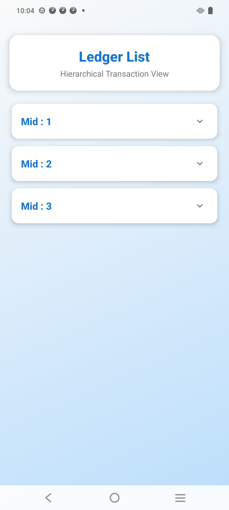
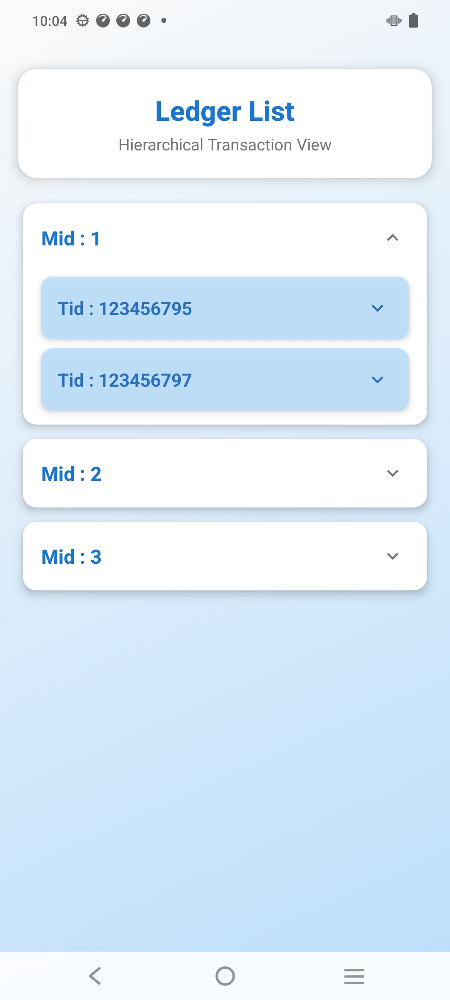
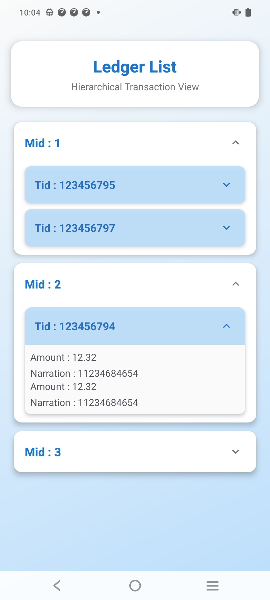
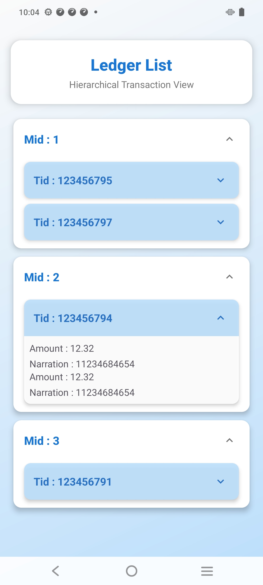

# MintoakLedger

<div align="center">


[](https://kotlinlang.org)
[](https://gradle.org)
[](https://developer.android.com)
[](https://developer.android.com)

</div>

## Overview

MintoakLedger is a modern Android application built with Kotlin, designed to provide robust ledger management capabilities. The application follows MVVM architecture pattern and leverages the latest Android development best practices.

## Screenshots

<div align="center">
  <div style="display: flex; flex-direction: row; gap: 10px; justify-content: center;">
    
    
    
    
  </div>
</div>

### Key Features

- 📊 Efficient ledger management
- 💼 Business transaction tracking
- 📱 Modern Material Design UI
- 🔄 Offline data persistence
- 📈 Financial reporting and analytics
- 🔐 Secure data handling

## Tech Stack

- **Language**: Kotlin
- **Architecture**: MVVM (Model-View-ViewModel)
- **UI Components**: Material Design 3
- **Asynchronous Programming**: Coroutines
- **View Binding**: Android View Binding
- **Dependencies**:
  - AndroidX Core KTX
  - AndroidX Lifecycle Components
  - Material Design Components
  - RecyclerView & CardView
  - Kotlin Coroutines

## Project Structure

```
app/src/main/
├── java/com/mahmood/mintoakledger/
│   ├── data/           # Data layer
│   ├── di/            # Dependency injection
│   ├── domain/        # Business logic and models
│   ├── presentation/  # UI layer
│   ├── MainActivity.kt
│   └── LedgerActivity.kt
└── res/               # Resources
```

## Getting Started

### Prerequisites

- Android Studio Arctic Fox or later
- JDK 8 or later
- Android SDK with minimum API level 24
- Latest Android Build Tools
- Git

### Installation

1. Clone the repository:
```bash
git clone https://github.com/yourusername/MintoakLedger.git
cd MintoakLedger
```

2. Open the project in Android Studio

3. Sync project with Gradle files

4. Run the application:
   - Select an Android device/emulator
   - Click the 'Run' button (⟩) or press Shift + F10

## Development

### Code Style

The project follows the official Kotlin coding conventions. Key aspects include:

- Kotlin coding conventions
- Clean Architecture principles
- MVVM pattern implementation
- Dependency injection best practices
- Comprehensive documentation


## Performance Optimization

- ViewBinding for efficient view access
- Coroutines for asynchronous operations
- Efficient data structures and algorithms


## Contact

For any inquiries, please reach out to (mailto:mycode7408@gmail.com)

---

Built with ❤️ Mahmood Ahmad Khan